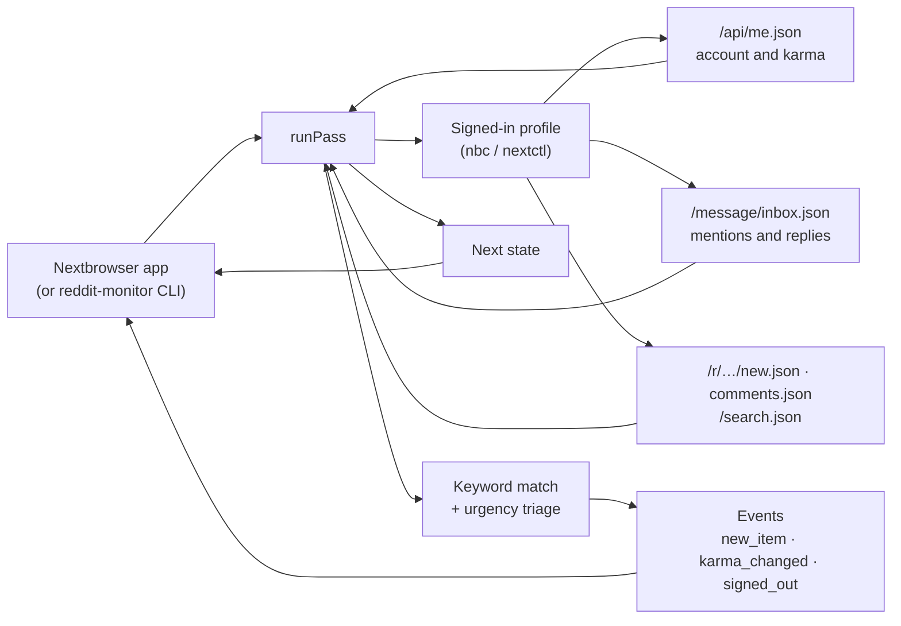

<p align="center">
  
</p>

<h1 align="center">Nextbrowser Reddit Monitoring</h1>

<p align="center">
  <strong>The open-source Reddit monitoring engine for Nextbrowser: mentions of your account and of your keywords, ranked by how urgently they need an answer, read from your own signed-in browser profile.</strong>
</p>

<p align="center">
  <a href="https://nextbrowser.com/">Website</a> ·
  <a href="https://github.com/nextbrowser-oss/nextbrowser-app">Nextbrowser app</a> ·
  <a href="https://docs.nextbrowser.com/">Product docs</a> ·
  <a href="docs/how-it-works.md">How it works</a> ·
  <a href="https://discord.com/invite/gHXEvkGXnz">Discord</a>
</p>

<p align="center">
  <a href="https://github.com/nextbrowser-oss/nextbrowser-reddit-monitoring/actions/workflows/ci.yml"></a>
  <a href="LICENSE"></a>
  
  
  <a href="https://github.com/nextbrowser-oss/nextbrowser-app"></a>
</p>

<p align="center">
  English ·
  <a href="docs/i18n/ru/README.md">Русский</a>
</p>

<p align="center">
  
</p>

## Why Nextbrowser Reddit Monitoring

This package is the engine behind Reddit monitoring in [Nextbrowser](https://github.com/nextbrowser-oss/nextbrowser-app). It runs inside the app, on a browser profile you have signed in to reddit.com, and on every pass it answers three questions:

- who mentioned or replied to the account;
- where on Reddit your keywords came up: a brand, a product, a competitor;
- which of those need an answer first.

It is open source because it works with your own account. Anyone can read exactly which requests it makes, what it keeps from the answers, and how it decides what is urgent.

- **Read-only.** It never votes, comments, replies, or subscribes, and it reads the inbox with `mark=false`, so not even the unread dot changes.
- **One small request per listing.** It asks reddit.com for the JSON of each listing, from a reddit.com tab with the profile's cookies, instead of loading pages with their pictures and scripts over the proxy.
- **Explainable triage.** Six fixed rules rank every match *high*, *medium* or *low*, and each match carries the reasons in plain words. No model is involved and nothing leaves the machine.
- **Owned by the app.** The engine keeps no timers, files, or network connections of its own. Nextbrowser runs a pass, stores the state, and decides what to show.

## From a mention to an approved reply

Monitoring is one half of the Reddit skill in Nextbrowser. The skill's panel switches between **Monitoring** and **Reply agent**:

| Step | Where | What happens |
| --- | --- | --- |
| 1. Keyword and mention detection | this engine | The inbox (username mentions, replies, private messages), the newest posts and comments of your communities, and a search of all of Reddit, matched against your keywords as whole words or phrases. |
| 2. Urgency triage | this engine | Each match is ranked: addressed to you, says an urgent term such as "refund" or "broken", asks a question, names a keyword in the title, has no replies yet, or is picking up fast. |
| 3. Response drafting | Nextbrowser's Reddit reply agent | The connected agent reads the thread and writes a reply to that specific item, never a canned line. |
| 4. Approval mode | Nextbrowser's Reddit reply agent | Every draft is shown to you first. Only the replies you approve are posted, and a reply log keeps a rerun from answering the same item twice. |

The engine stops at step 2 on purpose: whatever it finds, a person decides what gets said.

## Key features

| Area | What is available |
| --- | --- |
| Mentions | Username mentions, replies to your posts and comments, and private messages, from the inbox. Always ranked *high*. |
| Keywords | Up to 20 words or phrases, matched case-insensitively as whole words in any script ("nextbrowser" is found in "nextbrowser.com", not in "nextbrowsers"). Exclusion words drop the noise. |
| Communities | Up to 25 communities read on every pass: new posts, and new comments when keywords are set. Without keywords, every new post is reported. |
| Search | All of Reddit, newest first, a few keywords per query. Results are matched again locally, because Reddit's search is fuzzier than a keyword. |
| Urgency triage | *high*, *medium* or *low*, with the reasons, from rules you can read in [`src/triage.ts`](src/triage.ts). The urgent terms are a setting; they count only where a keyword is named or the account is addressed. |
| Counts | The account's karma, and each watched community's subscribers. |
| Embeddable core | `runPass(state) → { state, events, summary, matches }`, with no Node dependency, so it runs in the Nextbrowser renderer. |
| Standalone CLI | `reddit-monitor` drives any Nextbrowser profile through `nbc`/`nextctl`, for development and for running without the app. |

## In Nextbrowser

Nextbrowser ships the engine as a dependency and gives it three things:

- the browser it already drives for the selected profile;
- a place to keep the state;
- a timer.

```ts
import { normalizeState, runPass, scheduleDelay, withSettings } from "@nextbrowser-oss/reddit-monitoring";

const saved = withSettings(normalizeState(await load()), { keywords: ["nextbrowser"], communities: ["webdev"] });
const { state, events, summary, matches } = await runPass({
  browser: cliBrowser(profileArgs),          // the app's nextctl-backed browser for the profile
  state: saved,
  onEvent: (event) => notify(event),         // new_item, karma_changed, signed_out, ...
});
await save(state);
show(matches);                               // most urgent first, with the reasons
setTimeout(next, scheduleDelay(10 * 60_000, { backOff: !!summary.blocked || summary.rateLimited }));
```

The [integration guide](docs/integration.md) describes the contract between the app and the engine.

## Run it standalone

To develop the engine, or to run it without the app, use the bundled CLI. You need Node.js 22 or later and a Nextbrowser profile. Sign the profile in to reddit.com for the inbox and the karma; communities and search work signed out too. The CLI uses the `nextctl` binary managed by the app, or `nbc` from your `PATH`.

```bash
git clone https://github.com/nextbrowser-oss/nextbrowser-reddit-monitoring.git
cd nextbrowser-reddit-monitoring
npm ci
npm run build
node dist/node/bin.js run --profile <your-profile> --keywords "<brand>,<product name>" --communities <community1>,<community2>
```

What to expect:

1. The first pass records what every listing holds as a starting line and announces nothing.
2. Each later pass prints new matches, most urgent marked `HIGH`, with the reasons and a link, then waits about ten minutes (`--interval`).
3. Stop it with <kbd>Ctrl</kbd>+<kbd>C</kbd>. The next run continues from the saved state in `~/.nextbrowser/reddit-monitoring/<profile>.json`.

When you pipe the output to another program, it switches to JSON lines, one event per line. The [CLI reference](docs/cli-reference.md) lists every flag.

## How it works



Every pass does five things in order:

1. It puts the tab on reddit.com and asks who is signed in.
2. It reads the inbox, when the profile is signed in.
3. It reads each watched community, then searches Reddit for the keywords.
4. It reads the subscriber counts that are due.
5. It parks the tab.

The [how it works](docs/how-it-works.md) page explains the details:

- how an item is judged new, and why the first read announces nothing;
- how keywords are matched and why search results are matched again;
- every triage rule and its weight;
- what happens when reddit.com refuses the profile or rate-limits it.

## Documentation

- [How it works](docs/how-it-works.md): the pass step by step, freshness rules, keyword matching, urgency triage, refusals and rate limits.
- [Integration guide](docs/integration.md): the contract with the Nextbrowser app, the Node adapter, installing the package.
- [Events and state](docs/events-and-state.md): every event, the state document, and the settings.
- [CLI reference](docs/cli-reference.md): `reddit-monitor` commands, flags, output, and exit codes.
- [Troubleshooting](docs/troubleshooting.md): a refused profile, a private community, an empty inbox, profiles that will not start.

## Project status

This is an early release (`0.x`). Known limits:

- **Partly verified live.** On 2026-09-30 the engine ran from the Nextbrowser app on a signed-in profile: the account read, the inbox, and the new posts of three communities all answered, and the matches were ranked on the dashboard. The keyword search and triage on live keyword matches have not been run against reddit.com yet; they are covered by tests against stand-in answers of reddit.com's shapes.
- **Posts only in search.** Reddit's search covers posts, not comments. Comments are matched only in the communities you watch.
- **Counts only.** It tracks how much karma the account has and how many subscribers a community has, not who they are.

Proposals and bugs go to [GitHub Issues](https://github.com/nextbrowser-oss/nextbrowser-reddit-monitoring/issues). An issue is a proposal, not a release commitment.

## Contributing

Read [CONTRIBUTING.md](CONTRIBUTING.md) before opening a change. Keep changes focused. For any change to what is read from reddit.com, or to how a match is ranked, include tests. A README change must also update the [Russian edition](docs/i18n/ru/README.md).

## Community and support

- Join the [Nextbrowser Discord](https://discord.com/invite/gHXEvkGXnz) for community chat, setup help, and product updates.
- Ask general questions in [Nextbrowser Discussions](https://github.com/nextbrowser-oss/nextbrowser-app/discussions).
- Use [GitHub Issues](https://github.com/nextbrowser-oss/nextbrowser-reddit-monitoring/issues) for actionable, scoped work.
- Follow [SECURITY.md](SECURITY.md) for private vulnerability reporting. Do not publish security details in an issue.

## Responsible use

Monitor only accounts you own or are authorized to operate, and follow [Reddit's User Agreement](https://redditinc.com/policies/user-agreement) and the rules of each community. The monitor paces itself on purpose:

- at least one minute between passes, and a pass that is still running holds the next one back;
- a pause of a second or two between requests, like a person moving between pages;
- it stops before reddit.com's rate limit for the account runs out, and waits three intervals after a refusal;
- caps of 20 keywords and 25 communities.

Do not remove these limits to scrape at scale. Do not use what it finds to post unsolicited or repetitive replies: communities ban that, and Reddit suspends accounts for it.

## License

Nextbrowser Reddit Monitoring is open-source software available under the [GNU Affero General Public License v3.0 only](LICENSE).

AGPL-3.0 permits commercial use, modification, and redistribution. If you distribute a modified version or run it as a network service, the license requires you to offer the corresponding source code under the same license. This repository's dependencies remain under their respective licenses.

Copyright © 2026 Nextbrowser contributors.
