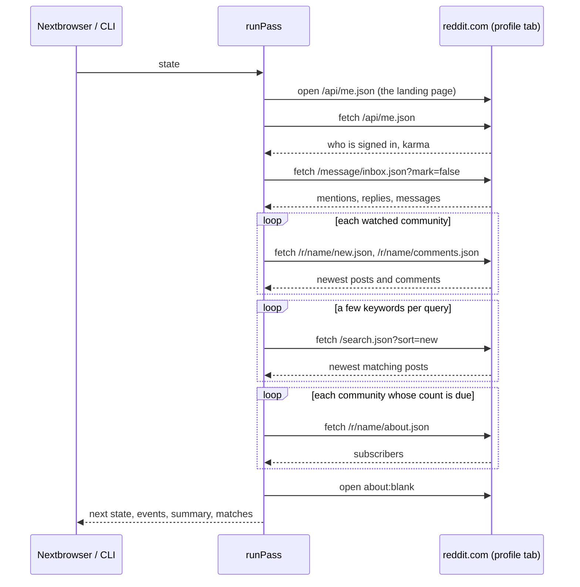

# How it works

A **pass** is one look at Reddit through a Nextbrowser profile. It takes the saved state in and returns the next state, the events, a summary, and the matches it found. It never changes the state it was given. A pass that is stopped or crashes halfway therefore leaves the last saved state intact, and a pass that finishes returns everything it learned.

The pass itself never waits longer than the pause between two requests. When the next pass runs is up to the caller: the Nextbrowser app or the CLI.

## Reading reddit.com

Every listing a person scrolls through on reddit.com is also served as JSON: add `.json` to the path. The pass puts the tab on reddit.com and asks for those from there, with `fetch` and the profile's own cookies, as same-origin requests from the site's own page. So a signed-in profile reads what its account sees, and a pass costs a handful of small requests instead of a page load each, with pictures and scripts, over the proxy.

The tab lands on `https://www.reddit.com/api/me.json`, the lightest page on the same origin as every listing. A tab that is already on reddit.com is used as it is. Each answer is cut down inside the page to the fields the monitor uses, so a search result's preview metadata never crosses CDP.

Between two requests the pass waits a second or two, like a person moving between pages.

## 1. Account

`/api/me.json` names the signed-in account and its karma. A signed-out session gets an empty object there, not an error.

| What reddit.com says | What the pass does |
| --- | --- |
| An account | Continues. The first pass, and the first pass after a sign-out, emit `signed_in`. The karma is recorded; a change emits `karma_changed`. |
| A different account than last time | Emits `account_changed`. The inbox starts over as a baseline, because another account has another inbox. |
| Nobody (signed out) | Emits `signed_out` once and sets `loginRequired`. The inbox and the karma are skipped; communities and search are read as usual, since they are public. |
| An error, such as HTTP 500 | Neither signed in nor out: the account stays what it was, and a note says why. |

## 2. Sources and what counts as new

A **source** is one listing: the inbox, a community's new posts, a community's new comments, or one search query. The pass reads them in that order. An item found by more than one source, such as a post in a watched community that the search also finds, is reported once, by the first.

The first time a source is read, what it holds is its **starting line**: the pass records the time and announces nothing from it. From then on, an item is new when:

- the pass has not seen it before (the state keeps the last 3,000 fullnames, across all sources);
- it was created after the source's starting line;
- it is not older than `maxItemAgeMs` (24 hours by default).

A source whose keyword set changes gets a new starting line. The same listing filtered by other keywords finds other things in it, and announcing a day of old matches at once is noise, not news. A source that is removed from the settings is forgotten, so adding it back starts over too. The inbox is kept while the profile is signed out, so the same account picks up where it left off after a sign-in.

New items are emitted as `new_item` events, oldest first within each source.

### After a long absence

A laptop that slept through the night comes back to listings it has not seen for hours. `maxItemAgeMs` keeps it from reporting all of those hours as fresh news.

## 3. Keywords

Keywords are words or phrases. An item matches a keyword when the keyword appears in its title, its text, or a link post's address:

- as a whole word or phrase: "next" is not found in "nextbrowser", and "nextbrowser" is found in "nextbrowser.com";
- case-insensitively, in any script ("браузер" is found in "Какой браузер выбрать?");
- with any run of spaces or line breaks inside a phrase.

**Exclusion words** drop an item even when a keyword matched: "hiring", "giveaway", a namesake that is not you.

Each source uses keywords differently:

| Source | Filtered by keywords |
| --- | --- |
| Inbox | Never. It is addressed to the account. |
| A community's posts | When keywords are set. Without keywords, every new post is reported. |
| A community's comments | Always. Comments are read only when keywords are set: every comment of a busy community is not news. |
| Search | Always, again. Reddit's search stems and fuzzes ("browser" finds "browsing"), so a search result is not yet a match. |

Search groups five keywords into one query joined with `OR`, and quotes phrases, so a pass with ten keywords makes two searches, not ten. Reddit's search covers posts only; comments are matched only in the communities you watch.

The account's own posts and comments are never reported.

## 4. Urgency triage

Every match is ranked by a few fixed rules. Each rule adds points and a reason in plain words:

| Rule | Points | Reason shown |
| --- | --- | --- |
| Addressed to the account: a username mention, a reply to its post or comment, a private message | +4 | "Mentions you", "Replies to your comment", "Replies to your post", "Private message" |
| Says an urgent term (`urgentTerms`, e.g. "refund", "broken", "not working") | +3 | `Says "refund"` |
| Asks a question: a question mark in the title or the opening lines, or a title that starts with a question word | +1 | "Asks a question" |
| A keyword is in the post's title, not just the text | +1 | `"nextbrowser" is in the title` |
| A post with no comments yet | +1 | "No replies yet" |
| A post under 12 hours old with 10 or more comments, or 50 or more points | +1 | "14 comments in 3 hours" |

Four points or more is **high**, two or three is **medium**, anything else is **low**. So anything addressed to the account is high; a complaint that names you in the title is high; an unanswered question about you is medium; a passing mention in someone's setup is low.

The rules are few and fixed on purpose. A person deciding what to answer first has to be able to see why the monitor put an item on top, and so does anyone reading the code before trusting it with their account. No model is involved, and nothing is sent anywhere.

`urgentTerms` has a default list in [`src/triage.ts`](../src/triage.ts). A team replaces it with its own words: an empty list is a valid choice and turns the rule off.

## 5. Counts

- **Karma.** The total, post and comment karma come with the account read, so they cost no request of their own. A change of the total emits `karma_changed`.
- **Subscribers.** Each watched community's count is one request to `/r/name/about.json`. It is read when due, every 30 minutes by default; with `countsIntervalMs: 0` it is read on every pass, which is what Nextbrowser does, since its schedule already sets how often a pass runs. A change emits `subscribers_changed`. A community that could not be read is retried after 10 minutes rather than on every pass.

## 6. Parking the tab

Once the reads are done, the pass opens `about:blank`, so nothing is left polling reddit.com between passes. Set `parkTab: false` to keep the page.

## When reddit.com says no

| What came back | What the pass does |
| --- | --- |
| A page instead of JSON, such as "You've been blocked by network security" | Stops. `summary.blocked` says what the page said. The next pass should wait three intervals (`scheduleDelay` with `backOff`). |
| No answer at all: a network error or a 20-second timeout | Stops, the same way. |
| HTTP 429, or reddit.com's rate-limit headers show fewer than three requests left | Stops early with `summary.rateLimited`. The rest is read next time. |
| A private, banned or quarantined community, or one that does not exist | Notes it and goes on with the next source. |

A pass that stops keeps everything it read before the stop, and every source it did not reach keeps its old state.

## What it never does

The engine only reads. It never votes, comments, replies, sends a message, joins a community, or changes a setting, and it reads the inbox with `mark=false`, so the unread count stays the account owner's. No script it runs uses any method but `GET`. It keeps no network connections, timers, or files of its own: everything goes through the browser and the state it is handed.
