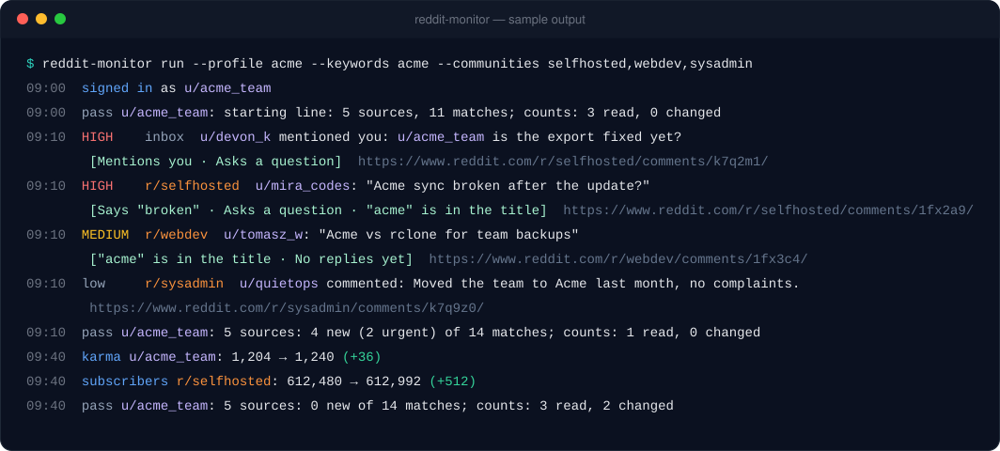
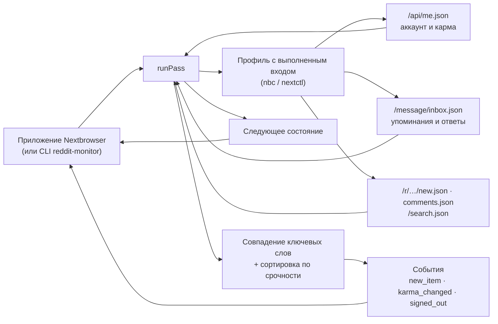

<p align="center">
  
</p>

<h1 align="center">Nextbrowser Reddit Monitoring</h1>

<p align="center">
  <strong>Открытый движок мониторинга Reddit для Nextbrowser: упоминания вашего аккаунта и ваших ключевых слов, отсортированные по тому, насколько срочно нужен ответ, — прямо из вашего браузерного профиля, в котором выполнен вход.</strong>
</p>

<p align="center">
  <a href="https://nextbrowser.com/">Сайт</a> ·
  <a href="https://github.com/nextbrowser-oss/nextbrowser-app">Приложение Nextbrowser</a> ·
  <a href="https://docs.nextbrowser.com/">Документация продукта</a> ·
  <a href="../../how-it-works.md">Как это работает</a> ·
  <a href="https://discord.com/invite/gHXEvkGXnz">Discord</a>
</p>

<p align="center">
  <a href="https://github.com/nextbrowser-oss/nextbrowser-reddit-monitoring/actions/workflows/ci.yml"></a>
  <a href="../../../LICENSE"></a>
  
  
  <a href="https://github.com/nextbrowser-oss/nextbrowser-app"></a>
</p>

<p align="center">
  <a href="../../../README.md">English</a> ·
  Русский
</p>

<p align="center">
  
</p>

## Зачем нужен Nextbrowser Reddit Monitoring

Этот пакет — движок, на котором работает мониторинг Reddit в [Nextbrowser](https://github.com/nextbrowser-oss/nextbrowser-app). Он работает внутри приложения, в браузерном профиле, где вы вошли в reddit.com, и за каждый проход отвечает на три вопроса:

- кто упомянул аккаунт или ответил ему;
- где на Reddit всплыли ваши ключевые слова: бренд, продукт, конкурент;
- на что из этого нужно ответить в первую очередь.

Код открыт, потому что движок работает с вашим собственным аккаунтом. Любой может прочитать, какие именно запросы он делает, что сохраняет из ответов и как решает, что срочно.

- **Только чтение.** Он никогда не голосует, не комментирует, не отвечает и не подписывается, а входящие читает с `mark=false`, так что не меняется даже счётчик непрочитанного.
- **Один маленький запрос на ленту.** Он просит у reddit.com JSON каждой ленты — с вкладки reddit.com, с cookies профиля, — вместо того чтобы грузить страницы с картинками и скриптами через прокси.
- **Объяснимая сортировка.** Шесть фиксированных правил ставят каждому совпадению уровень *high*, *medium* или *low*, и к каждому прилагаются причины обычными словами. Никакой модели, и ничего не уходит с машины.
- **Хозяин — приложение.** У движка нет своих таймеров, файлов и сетевых соединений. Nextbrowser запускает проход, хранит состояние и решает, что показать.

## От упоминания до одобренного ответа

Мониторинг — это половина Reddit-скилла в Nextbrowser. Панель скилла переключается между **Monitoring** и **Reply agent**:

| Шаг | Где | Что происходит |
| --- | --- | --- |
| 1. Поиск ключевых слов и упоминаний | этот движок | Входящие (упоминания username, ответы, личные сообщения), свежие посты и комментарии ваших сообществ и поиск по всему Reddit — всё сверяется с ключевыми словами как с целыми словами или фразами. |
| 2. Сортировка по срочности | этот движок | Каждое совпадение получает ранг: обращено к вам, содержит срочное слово вроде «refund» или «broken», задаёт вопрос, называет ключевое слово в заголовке, ещё без ответов или быстро набирает обороты. |
| 3. Черновик ответа | Reddit reply agent в Nextbrowser | Подключённый агент читает тред и пишет ответ именно на этот пост или комментарий, а не шаблонную фразу. |
| 4. Режим одобрения | Reddit reply agent в Nextbrowser | Каждый черновик сначала показывается вам. Публикуются только одобренные ответы, а журнал ответов не даёт повторному запуску ответить на то же самое дважды. |

Движок намеренно останавливается на шаге 2: что бы он ни нашёл, что сказать в ответ, решает человек.

## Основные возможности

| Область | Что доступно |
| --- | --- |
| Упоминания | Упоминания username, ответы на ваши посты и комментарии, личные сообщения — из входящих. Всегда уровень *high*. |
| Ключевые слова | До 20 слов или фраз, без учёта регистра, как целые слова в любом алфавите («nextbrowser» находится в «nextbrowser.com», но не в «nextbrowsers»). Слова-исключения отсекают шум. |
| Сообщества | До 25 сообществ, читаемых на каждом проходе: новые посты, а при заданных ключевых словах — и новые комментарии. Без ключевых слов сообщается о каждом новом посте. |
| Поиск | Весь Reddit, сначала новое, по несколько ключевых слов на запрос. Результаты сверяются заново локально, потому что поиск Reddit размытее ключевого слова. |
| Сортировка по срочности | *high*, *medium* или *low* с причинами — по правилам, которые можно прочитать в [`src/triage.ts`](../../../src/triage.ts). Срочные слова — это настройка. |
| Счётчики | Карма аккаунта и число подписчиков каждого отслеживаемого сообщества. |
| Встраиваемое ядро | `runPass(state) → { state, events, summary, matches }` без зависимости от Node, поэтому работает в рендерере Nextbrowser. |
| Отдельный CLI | `reddit-monitor` управляет любым профилем Nextbrowser через `nbc`/`nextctl` — для разработки и для работы без приложения. |

## В Nextbrowser

Nextbrowser поставляет движок как зависимость и даёт ему три вещи:

- браузер, которым приложение уже управляет для выбранного профиля;
- место для хранения состояния;
- таймер.

```ts
import { normalizeState, runPass, scheduleDelay, withSettings } from "@nextbrowser-oss/reddit-monitoring";

const saved = withSettings(normalizeState(await load()), { keywords: ["nextbrowser"], communities: ["webdev"] });
const { state, events, summary, matches } = await runPass({
  browser: cliBrowser(profileArgs),          // the app's nextctl-backed browser for the profile
  state: saved,
  onEvent: (event) => notify(event),         // new_item, karma_changed, signed_out, ...
});
await save(state);
show(matches);                               // most urgent first, with the reasons
setTimeout(next, scheduleDelay(10 * 60_000, { backOff: !!summary.blocked || summary.rateLimited }));
```

Контракт между приложением и движком описан в [руководстве по интеграции](../../integration.md).

## Запуск отдельно

Чтобы разрабатывать движок или запускать его без приложения, используйте встроенный CLI. Нужны Node.js 22 или новее и профиль Nextbrowser. Для входящих и кармы войдите в профиле в reddit.com; сообщества и поиск работают и без входа. CLI использует бинарник `nextctl`, которым управляет приложение, или `nbc` из `PATH`.

```bash
git clone https://github.com/nextbrowser-oss/nextbrowser-reddit-monitoring.git
cd nextbrowser-reddit-monitoring
npm ci
npm run build
node dist/node/bin.js run --profile <your-profile> --keywords "<brand>,<product name>" --communities <community1>,<community2>
```

Чего ожидать:

1. Первый проход записывает содержимое каждой ленты как стартовую линию и ни о чём не сообщает.
2. Каждый следующий проход печатает новые совпадения — самые срочные с пометкой `HIGH`, с причинами и ссылкой, — и ждёт около десяти минут (`--interval`).
3. Остановите его <kbd>Ctrl</kbd>+<kbd>C</kbd>. Следующий запуск продолжит с сохранённого состояния в `~/.nextbrowser/reddit-monitoring/<profile>.json`.

Если направить вывод в другую программу, он переключается на JSON Lines — одно событие на строку. Все флаги перечислены в [справочнике CLI](../../cli-reference.md).

## Как это работает



Каждый проход делает пять вещей по порядку:

1. Открывает reddit.com во вкладке и спрашивает, кто вошёл.
2. Читает входящие, если в профиле выполнен вход.
3. Читает каждое отслеживаемое сообщество, затем ищет ключевые слова по Reddit.
4. Читает счётчики подписчиков, которым пора обновиться.
5. Паркует вкладку.

На странице [«Как это работает»](../../how-it-works.md) подробно описано:

- как элемент признаётся новым и почему первое чтение ни о чём не сообщает;
- как сверяются ключевые слова и почему результаты поиска сверяются заново;
- каждое правило сортировки и его вес;
- что происходит, когда reddit.com отказывает профилю или ограничивает частоту запросов.

## Документация

- [Как это работает](../../how-it-works.md): проход шаг за шагом, правила новизны, сверка ключевых слов, сортировка по срочности, отказы и лимиты.
- [Руководство по интеграции](../../integration.md): контракт с приложением Nextbrowser, Node-адаптер, установка пакета.
- [События и состояние](../../events-and-state.md): все события, документ состояния и настройки.
- [Справочник CLI](../../cli-reference.md): команды, флаги, вывод и коды выхода `reddit-monitor`.
- [Решение проблем](../../troubleshooting.md): профиль, которому отказали, приватное сообщество, пустые входящие, профиль, который не запускается.

## Статус проекта

Это ранний выпуск (`0.x`). Известные ограничения:

- **Ещё не проверен вживую.** Запросы идут к публичным JSON-лентам reddit.com, и каждый скрипт протестирован на подставных ответах того же вида, включая страницу отказа, которую reddit.com показывает профилю без доверия. Прогон на живом профиле с выполненным входом ещё предстоит; до тех пор проверяйте сообщения «refused» и «not found» вручную.
- **В поиске — только посты.** Поиск Reddit охватывает посты, но не комментарии. Комментарии сверяются только в сообществах, которые вы отслеживаете.
- **Только счётчики.** Он отслеживает, сколько кармы у аккаунта и сколько подписчиков у сообщества, но не кто они.

Предложения и баги — в [GitHub Issues](https://github.com/nextbrowser-oss/nextbrowser-reddit-monitoring/issues). Issue — это предложение, а не обязательство выпустить.

## Участие в разработке

Прочитайте [CONTRIBUTING.md](../../../CONTRIBUTING.md), прежде чем открывать изменение. Держите изменения сфокусированными. Любое изменение того, что читается с reddit.com, или того, как ранжируется совпадение, должно сопровождаться тестами. Изменение README должно обновлять и [русскую версию](README.md).

## Сообщество и поддержка

- Присоединяйтесь к [Discord Nextbrowser](https://discord.com/invite/gHXEvkGXnz): общение, помощь с настройкой и новости продукта.
- Общие вопросы задавайте в [Nextbrowser Discussions](https://github.com/nextbrowser-oss/nextbrowser-app/discussions).
- [GitHub Issues](https://github.com/nextbrowser-oss/nextbrowser-reddit-monitoring/issues) — для конкретной, ограниченной по объёму работы.
- Об уязвимостях сообщайте приватно по [SECURITY.md](../../../SECURITY.md). Не публикуйте детали уязвимостей в issue.

## Ответственное использование

Отслеживайте только аккаунты, которыми вы владеете или управлять которыми вам разрешено, и соблюдайте [пользовательское соглашение Reddit](https://redditinc.com/policies/user-agreement) и правила каждого сообщества. Монитор намеренно соблюдает темп:

- не меньше минуты между проходами, и незавершённый проход задерживает следующий;
- пауза в секунду-две между запросами, как у человека, переходящего между страницами;
- остановка до того, как у аккаунта закончится лимит запросов reddit.com, и ожидание трёх интервалов после отказа;
- не больше 20 ключевых слов и 25 сообществ.

Не снимайте эти ограничения ради массового сбора данных. Не используйте найденное для непрошеных или однотипных ответов: сообщества за это банят, а Reddit блокирует аккаунты.

## Лицензия

Nextbrowser Reddit Monitoring — открытое программное обеспечение под лицензией [GNU Affero General Public License v3.0 only](../../../LICENSE).

AGPL-3.0 разрешает коммерческое использование, изменение и распространение. Если вы распространяете изменённую версию или запускаете её как сетевой сервис, лицензия требует предоставить соответствующий исходный код на тех же условиях. Зависимости этого репозитория остаются под своими лицензиями.

Copyright © 2026 Nextbrowser contributors.
